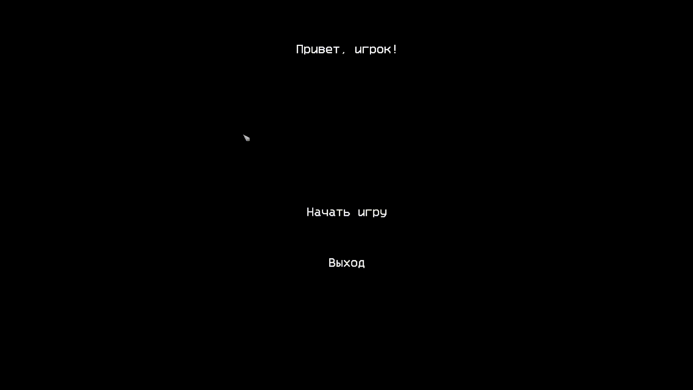
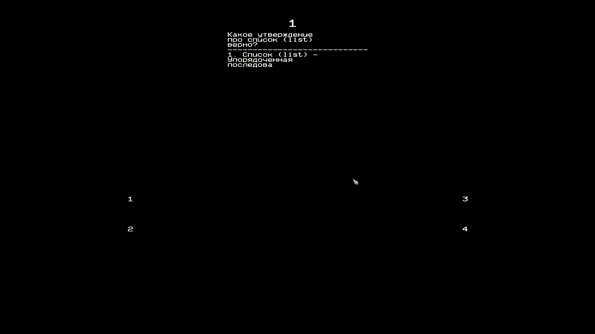

# Серия игр-викторин для ПК, на знания основ Python, Django и [будет дополняться]

На данный доступны две демо игры (Quiz Python, Quiz Django)

## Описание

Это игры-викторины, где игрок отвечает на базовые (прям очень базовые!) вопросы языка программирования Python. Игра представляет собой интерактивный опрос, где игроку предлагается серия вопросов с вариантами ответов. Игрок выбирает один из вариантов ответа, а затем получает обратную связь о правильности своего ответа. За каждый правильный ответ игрок получает очки. По завершении викторины игроку показывается общее количество набранных очков. Игра также имеет возможность начать заново или выйти из игры.

### Django викторина



### Python викторина



### Как запустить проект

Установить фреймворк ursina engine

```pip install ursina
```

Перейти в нужную папку

```cd django_quiz
```

Запустить приложение

```python quiz_django.py
```

#### Если не хочется развёртывать проект, то есть zip архивы с .exe файлом игры

## Стек проекта

- Python 3.9.10
- Ursina Engine
- PyInstaller

Автор: [Игорь Любаев](https://github.com/Igor-L12)
